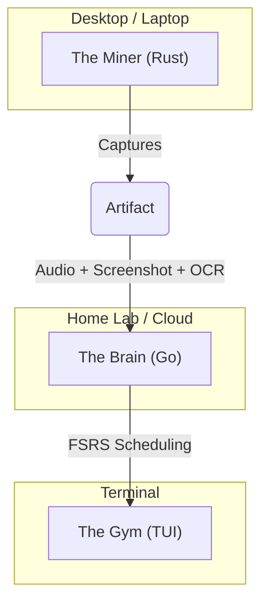

# Polybius

**The Context-First Sentence Mining Engine for Engineers.**

> *"Skritter and Anki are unit tests for vocabulary. Polybius is the integration test."*

## The Problem

Most language learning apps (Skritter, Duolingo) teach vocabulary in a vacuum. You learn that `对` means "Correct," but you miss the emotion, speed, and slur of a native speaker screaming it in a movie.

## The Solution: "The Time Machine"

Polybius is a local daemon that sits in your system tray while you watch Netflix, YouTube, or play games in your target language.

1. **The Watch:** You listen to native content.
2. **The Trigger:** You hear a sentence you want to learn.
3. **The Capture:** You hit a hotkey: `Ctrl+Alt+1` (10s), `Ctrl+Alt+2` (30s), or `Ctrl+Alt+3` (60s).
4. **The Artifact:** Polybius instantly saves the audio (buffered in RAM) and a **screenshot** of the scene (with subtitles) to your library.

No manual recording. No downloading video files. Zero friction.

---

## Table of Contents

- [Architecture](#architecture)
- [System Requirements](#system-requirements)
- [Installation](#installation)
- [Quick Start](#quick-start)
- [Configuration](#configuration)
- [Output Files](#output-files)
- [OCR Language Setup](#ocr-language-setup)
- [Troubleshooting](#troubleshooting)
- [Tech Stack](#tech-stack)
- [Roadmap](#roadmap)
- [Development](#development)
- [License](#license)

---

## Architecture

Polybius is designed as a distributed system to support a "Capture Locally, Review Anywhere" workflow.



### 1. The Miner (Current MVP - v0.4.0)

A high-performance Rust binary running on Windows.

* **Audio:** Uses `cpal` to tap into WASAPI Loopback. Maintains lock-free ring buffers (`ringbuf`) for 10s, 30s, and 60s durations.
* **System Tray:** Lives in your system tray with context menu for capture, pause/resume, and settings.
* **Configuration:** TOML-based config file at platform-standard location.
* **Vision:** Uses Windows Native OCR to extract text from screenshots alongside audio capture.
* **Performance:** Zero allocations in the hot audio loop.

### 2. The Brain (Planned)

A central API written in Go.

* **NLP:** Segments sentences (using `jieba` for Chinese) to identify "i+1" sentences (where you know all words except one).
* **SRS:** Uses the **FSRS** (Free Spaced Repetition Scheduler) algorithm to schedule reviews.

### 3. The Gym (Planned)

A Terminal User Interface (TUI) for study sessions.

* Plays the actual audio clip you mined.
* Shows the screenshot with the target word blurred.

---

## System Requirements

| Requirement | Details |
|-------------|---------|
| **OS** | Windows 10/11 (required for WASAPI Loopback & native OCR) |
| **Rust** | Latest stable (1.70+) |
| **RAM** | ~16 MB for default buffers (10s + 30s enabled) |
| **Disk** | ~500 KB per 10s capture (audio + screenshot + metadata) |

### Memory Footprint by Buffer Configuration

| Buffer | Memory Usage |
|--------|--------------|
| 10 seconds | ~4 MB |
| 30 seconds | ~12 MB |
| 60 seconds | ~24 MB |
| **Default (10s + 30s)** | **~16 MB** |

---

## Installation

### Option 1: Build from Source (Recommended)

```bash
# Clone the repository
git clone https://github.com/mitchelldurbincs/polybius.git
cd polybius

# Build release binary (optimized)
cargo build --release

# The binary will be at: target/release/miner.exe
```

### Option 2: Run in Development Mode

```bash
# For quick testing (slower, unoptimized)
cargo run
```

### Release Build Optimizations

The release build includes these optimizations in `Cargo.toml`:

```toml
[profile.release]
opt-level = 3      # Maximum optimization
lto = true         # Link-time optimization
strip = true       # Strip symbols (smaller binary)
```

---

## Quick Start

1. **Run the application:**
   ```bash
   ./target/release/miner.exe
   ```

2. **Look for the system tray icon** - Polybius runs in the background.

3. **Start watching content** in your target language (YouTube, Netflix, games, etc.).

4. **When you hear a sentence you want to mine, press:**
   | Hotkey | Duration | Use Case |
   |--------|----------|----------|
   | `Ctrl + Alt + 1` | 10 seconds | Short phrases, single words |
   | `Ctrl + Alt + 2` | 30 seconds | Full sentences, dialogue |
   | `Ctrl + Alt + 3` | 60 seconds | Extended context, conversations |

5. **Check your save directory** (default: `~/Music/Miner`) for captured files.

### System Tray Menu Options

Right-click the tray icon to access:

| Menu Item | Description |
|-----------|-------------|
| **Save 10s / 30s / 60s** | Manual capture (same as hotkeys) |
| **Pause / Resume** | Temporarily stop/start audio recording |
| **Open Folder** | Open the save directory in file explorer |
| **Settings** | Open config.toml in your default editor |
| **Quit** | Exit the application |

---

## Configuration

The config file is created automatically on first run.

### Config File Locations

| Platform | Path |
|----------|------|
| **Windows** | `%APPDATA%\miner\config.toml` |
| **macOS** | `~/Library/Application Support/miner/config.toml` |
| **Linux** | `~/.config/miner/config.toml` |

### Full Configuration Reference

```toml
[general]
# Where to save captured audio, screenshots, and metadata
save_directory = "~/Music/Miner"

# Show desktop notifications on capture
notifications = true

[hotkeys]
# Hotkey format: MODIFIER+MODIFIER+KEY
# Modifiers: CTRL, ALT, SHIFT, SUPER (Windows key)
save_10s = "CTRL+ALT+1"
save_30s = "CTRL+ALT+2"
save_60s = "CTRL+ALT+3"

[audio]
# Enable/disable individual ring buffers
# Disable unused buffers to save memory
buffer_10s = true      # ~4 MB memory
buffer_30s = true      # ~12 MB memory
buffer_60s = false     # ~24 MB memory (disabled by default)

[vision]
# Master switch for all vision features
enabled = true

# Capture screenshots on save
screenshot_enabled = true

# Screenshot capture mode:
# - "screen": Entire primary monitor
# - "foreground": Currently focused window (recommended)
# - "window": Specific window by title (not yet implemented)
capture_mode = "foreground"

# Enable OCR text extraction from screenshots
ocr_enabled = true

# OCR language (BCP-47 language tag)
# Common values: "en-US", "zh-Hans", "zh-Hant", "ja", "ko", "es-ES", "de-DE"
ocr_language = "en-US"

# Generate JSON metadata file alongside audio/screenshot
metadata_enabled = true
```

### Common Configuration Examples

**Chinese Learner:**
```toml
[vision]
ocr_enabled = true
ocr_language = "zh-Hans"  # Simplified Chinese
# or "zh-Hant" for Traditional Chinese
```

**Japanese Learner:**
```toml
[vision]
ocr_enabled = true
ocr_language = "ja"
```

**Minimal Memory Usage:**
```toml
[audio]
buffer_10s = true
buffer_30s = false
buffer_60s = false
```

**Full Buffers (40 MB):**
```toml
[audio]
buffer_10s = true
buffer_30s = true
buffer_60s = true
```

---

## Output Files

Each capture creates three files with the same timestamp:

```
~/Music/Miner/
├── audio_1736700000.wav      # Audio recording
├── audio_1736700000.png      # Screenshot
└── audio_1736700000.json     # Metadata
```

### Audio File (.wav)

- **Format:** 16-bit PCM WAV
- **Sample Rate:** 48000 Hz (matches system audio)
- **Channels:** Stereo (2 channels)
- **Size:** ~1 MB per 10 seconds

### Screenshot File (.png)

- **Format:** PNG (lossless)
- **Resolution:** Matches your screen/window
- **Size:** ~100-500 KB depending on content

### Metadata File (.json)

```json
{
  "version": "1.0",
  "timestamp": "2024-01-12T15:30:45Z",
  "audio": {
    "file": "audio_1736700000.wav",
    "duration_seconds": 10.0,
    "sample_rate": 48000,
    "channels": 2
  },
  "screenshot": {
    "file": "audio_1736700000.png",
    "width": 1920,
    "height": 1080
  },
  "ocr": {
    "language": "zh-Hans",
    "text": "你好世界",
    "words": [
      {
        "text": "你好",
        "bbox": [100, 200, 50, 30],
        "confidence": 0.95
      },
      {
        "text": "世界",
        "bbox": [160, 200, 50, 30],
        "confidence": 0.98
      }
    ]
  }
}
```

---

## OCR Language Setup

Polybius uses Windows' built-in OCR engine, which requires language packs to be installed.

### Installing Language Packs

1. **Open Windows Settings** → Time & Language → Language & Region

2. **Click "Add a language"** and search for your target language

3. **Select the language** and ensure "Optical character recognition" is checked during installation

4. **Update your config.toml** with the correct BCP-47 language tag:

### Supported Language Tags

| Language | Tag | Notes |
|----------|-----|-------|
| English (US) | `en-US` | Usually pre-installed |
| English (UK) | `en-GB` | |
| Chinese (Simplified) | `zh-Hans` | Mainland China |
| Chinese (Traditional) | `zh-Hant` | Taiwan, Hong Kong |
| Japanese | `ja` | |
| Korean | `ko` | |
| Spanish | `es-ES` | |
| French | `fr-FR` | |
| German | `de-DE` | |
| Portuguese | `pt-BR` | Brazilian |
| Russian | `ru` | |

### Verifying Installed Languages

You can check installed OCR languages via PowerShell:

```powershell
Get-WindowsCapability -Online | Where-Object { $_.Name -Like 'Language.OCR*' }
```

---

## Troubleshooting

### No Audio Being Captured

**Symptom:** WAV files are silent or empty.

**Solutions:**
1. Ensure audio is playing through your default output device
2. Check that "Stereo Mix" or audio loopback is enabled in Windows Sound settings
3. Try restarting the application after starting audio playback

### Hotkeys Not Working

**Symptom:** Pressing `Ctrl+Alt+1/2/3` does nothing.

**Solutions:**
1. Check if another application has registered the same hotkeys
2. Run Polybius as Administrator (some games require elevated privileges)
3. Verify hotkey configuration in `config.toml`

### OCR Not Extracting Text

**Symptom:** JSON metadata has empty OCR text.

**Solutions:**
1. Verify the language pack is installed (see [OCR Language Setup](#ocr-language-setup))
2. Check that `ocr_language` in config.toml matches your installed language pack
3. Ensure subtitles are visible and not too small/stylized

### Application Won't Start

**Symptom:** Crashes on startup or tray icon doesn't appear.

**Solutions:**
1. Check Windows Event Viewer for error details
2. Delete config file and let it regenerate: `del %APPDATA%\miner\config.toml`
3. Ensure you're running on Windows 10/11

### High Memory Usage

**Symptom:** Application using more RAM than expected.

**Solutions:**
1. Disable unused buffers in config:
   ```toml
   [audio]
   buffer_60s = false
   ```
2. Consider using only the 10s buffer for minimal footprint (~4 MB)

### Save Directory Issues

**Symptom:** Files not appearing or permission errors.

**Solutions:**
1. Ensure the save directory exists and is writable
2. Use an absolute path in config: `save_directory = "C:\\Users\\YourName\\Music\\Miner"`
3. Check that the drive has sufficient free space

---

## Tech Stack

| Category | Libraries |
|----------|-----------|
| **Core** | Rust |
| **Audio** | `cpal` (WASAPI), `hound` (WAV), `ringbuf` (lock-free buffers) |
| **System** | `global-hotkey`, `tray-icon`, `winit`, `notify-rust` |
| **Windows** | `windows-rs` (WinRT APIs), `win-screenshot` |
| **Config** | `serde`, `toml`, `directories` |
| **Vision** | `image` (PNG encoding), Windows.Media.Ocr |

---

## Roadmap

### Completed

- [x] **Stage 1:** Core Audio Engine - Ring buffer recording without priority inversion
- [x] **Stage 2:** Hotkeys - Global capture triggers (10s/30s/60s)
- [x] **Stage 3:** System Tray - Full tray integration with context menu
- [x] **Stage 3:** Multi-Duration Buffers - Configurable 10s, 30s, and 60s buffers
- [x] **Stage 3:** Configuration - TOML-based config with platform-standard paths
- [x] **Stage 4:** Vision Module - Screenshot capture & OCR integration
- [x] **Stage 4:** Metadata - JSON metadata format for captured artifacts

### Planned

- [ ] **Stage 5:** The Brain - Go backend with REST API
  - NLP pipeline (sentence segmentation)
  - FSRS scheduling algorithm
  - SQLite database for cards and reviews
  - i+1 engine for optimal learning

- [ ] **Stage 6:** The Gym - TUI review interface
  - Audio playback of captured clips
  - Screenshot display with word blurring
  - Progress tracking and analytics

- [ ] **Future:** Cross-platform support (macOS, Linux)
- [ ] **Future:** Cloud sync for multi-device access

---

## Development

### Building from Source

```bash
# Debug build (faster compile, slower runtime)
cargo build

# Release build (slower compile, optimized runtime)
cargo build --release

# Run with logging
RUST_LOG=debug cargo run
```

### Project Structure

```
polybius/
├── src/
│   ├── main.rs          # Entry point, event loop, save logic
│   ├── audio.rs         # WASAPI loopback, ring buffers
│   ├── config.rs        # TOML configuration management
│   ├── hotkeys.rs       # Global hotkey registration
│   ├── tray.rs          # System tray icon and menu
│   ├── vision.rs        # Unified screenshot + OCR interface
│   ├── screenshot.rs    # Screen/window capture
│   ├── ocr.rs           # Windows native OCR
│   ├── metadata.rs      # JSON metadata generation
│   ├── notifications.rs # Desktop notifications
│   └── wav.rs           # WAV file writing
├── Cargo.toml           # Dependencies and build config
├── config.toml          # Example configuration
└── README.md            # This file
```

### Running Tests

```bash
cargo test
```

### Contributing

1. Fork the repository
2. Create a feature branch: `git checkout -b feature/my-feature`
3. Make your changes and commit: `git commit -m "Add my feature"`
4. Push to your fork: `git push origin feature/my-feature`
5. Open a Pull Request

---

## License

MIT License.

---

## Acknowledgments

- [cpal](https://github.com/RustAudio/cpal) - Cross-platform audio I/O
- [FSRS](https://github.com/open-spaced-repetition/fsrs4anki) - Free Spaced Repetition Scheduler
- The language learning community for inspiration
